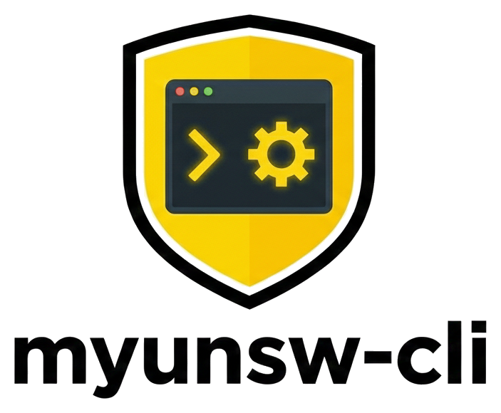

<div align="center">



<p>
  
  
  
  
  
</p>

**Reverse-engineered myUNSW API for AI-powered enrollment automation**

No scraping. No passwords. No browser automation. Just documented endpoints + a session cookie.

English | [简体中文](README_CN.md)

[Features](#tested-workflows) · [Quick Start](#quick-start) · [Architecture](#architecture) · [API Reference](docs/api-reference.md) · [Deployment](docs/deployment.md)

</div>

---

## What is this?

[myUNSW](https://my.unsw.edu.au) is the student portal for UNSW Sydney. It runs on a legacy Java framework (BSDS) with no official API.

This project reverse-engineers the portal and documents every endpoint, enabling:

- **AI-powered enrollment** — let Claude/Codex/Gemini handle class selection via natural language
- **CLI automation** — check grades, timetable, fees, waitlist positions from terminal
- **Programmatic access** — hidden JSON APIs that return structured data

## Tested Workflows

| Workflow | Status | Notes |
|----------|--------|-------|
| View enrollment status | ✅ | JSON API returns all class data |
| Select classes | ✅ | Full class selection flow |
| View timetable | ✅ | JSON API with room/time/weeks |
| View grades (all terms) | ✅ | POST-based term switching |
| Download academic statement | ✅ | PDF auto-download |
| View fees | ✅ | All term fee statements |
| Class search | ✅ | 15+ filter parameters |
| View personal info | ✅ | Address, phone, email, emergency |
| Waitlist management | ✅ | Join/leave/check position |
| Confirm enrollment | ⚠️ | May require browser (anti-automation) |

## Quick Start

### 1. Install

```bash
git clone https://github.com/Genius-Cai/myunsw-cli.git
cd myunsw-cli
./install.sh    # auto-detects Claude Code / Codex / OpenClawd
```

### 2. Get Your Session Cookie

Install [Get cookies.txt LOCALLY](https://chromewebstore.google.com/detail/get-cookiestxt-locally/cclelndahbckbenkjhflpdbgdldlbecc) (free Chrome extension), log in to [myUNSW](https://my.unsw.edu.au), navigate to any `/active/` page, export cookies, then:

```bash
mv ~/Downloads/cookies.txt /tmp/myunsw_active.txt
```

Or manually: see [deployment guide](docs/deployment.md) for DevTools method.

### 3. Choose Your Platform

<details>
<summary><b>Claude Code</b> (recommended)</summary>

```bash
# Slash command
cp commands/myunsw.md ~/.claude/commands/myunsw.md

# Or as a skill (Agent Skills standard)
mkdir -p ~/.claude/skills/myunsw-cli
cp SKILL.md ~/.claude/skills/myunsw-cli/SKILL.md

# Use it
# /myunsw setup     ← paste your cookies
# /myunsw grades    ← view all grades
# /myunsw status    ← check enrollment
```

</details>

<details>
<summary><b>Codex CLI (OpenAI)</b></summary>

```bash
# Copy the agent instructions
cp skills/AGENTS.md /path/to/your/project/AGENTS.md

# Use with Codex
codex "check my UNSW enrollment status"
codex "show my grades for T3 2025"
```

</details>

<details>
<summary><b>Gemini CLI (Google)</b></summary>

```bash
# Copy as Gemini context
cp skills/GEMINI.md /path/to/your/project/GEMINI.md

# Use with Gemini CLI
gemini "check my UNSW grades"
```

</details>

<details>
<summary><b>OpenClawd</b></summary>

```bash
# Copy skill to OpenClawd config
cp skills/myunsw.md ~/.openclawd/skills/myunsw.md

# Or load as context
openclawd --skill myunsw "check my enrollment status"
```

</details>

<details>
<summary><b>Claude.ai (Web)</b></summary>

1. Create a new Project in Claude.ai
2. Upload `skills/myunsw.md` to Project Knowledge
3. Chat: "Help me check my UNSW enrollment. Here are my cookies: ..."

</details>

<details>
<summary><b>Cursor / Windsurf</b></summary>

```bash
# Cursor
mkdir -p .cursor/rules && cp skills/myunsw.md .cursor/rules/myunsw.md

# Windsurf
cp skills/myunsw.md .windsurfrules/myunsw.md
```

</details>

<details>
<summary><b>Raw curl (no AI needed)</b></summary>

```bash
# Write your cookie file
cat > /tmp/myunsw_active.txt << EOF
my.unsw.edu.au	FALSE	/active	FALSE	0	JSESSIONID	YOUR_JSESSIONID_HERE
my.unsw.edu.au	FALSE	/	FALSE	0	AWSALB	YOUR_AWSALB_HERE
my.unsw.edu.au	FALSE	/	FALSE	0	AWSALBCORS	YOUR_AWSALBCORS_HERE
EOF

# Check enrollment — returns JSON!
COOKIE="/tmp/myunsw_active.txt"
ENR="https://my.unsw.edu.au/active/studentClassEnrol"

SEQ=$(curl -s -b $COOKIE "$ENR/years.xml" | grep -oP 'bsdsSequence" value="\K[0-9]+')
curl -s -L -b $COOKIE -d "bsdsSequence=$SEQ&year=2026&bsdsSubmit-update-enrol=Update+Enrolment" "$ENR/years.xml" -o /tmp/c.html
SEQ=$(grep -oP 'bsdsSequence" value="\K[0-9]+' /tmp/c.html)
curl -s -b $COOKIE "$ENR/courses.xml?term=5263"
curl -s -L -b $COOKIE -d "bsdsSequence=$SEQ&term=5263&bsdsSubmit-view-timetable=View+Timetable" "$ENR/courses.xml" -o /tmp/t.html
curl -s -b $COOKIE "$ENR/timetable.xml?data=classes" | python3 -m json.tool
```

</details>

## Architecture

myUNSW uses a three-layer session architecture:

```
Browser Login
  → CAS SSO (sso.unsw.edu.au)     ← TGC cookie (HttpOnly)
    → Portal (/portal)             ← JSESSIONID (path=/portal)  ← DON'T USE
    → Active (/active)             ← JSESSIONID (path=/active)  ← USE THIS
```

Every form uses the **BSDS framework** — a server-side state machine:

```
1. GET page           → extract bsdsSequence from hidden input
2. POST to SAME URL   → bsdsSequence + bsdsSubmit-{action} + params
3. Follow 302         → server redirects to next state
4. Repeat with new bsdsSequence
```

> **Rule #1**: `bsdsSequence` increments with every page load. Always use the freshest value.

For full technical details, see [docs/api-reference.md](docs/api-reference.md).

## Discovered Endpoints

### 27 endpoints mapped across 5 categories:

| Category | Endpoints | JSON API? |
|----------|-----------|-----------|
| Enrollment | years, courses, classes, timetable | ✅ `?data=classes` |
| Academic | results, statement, timetable, exam, standing | PDF download |
| Personal | address, phone, email, name, emergency, SMS, stats | Read + Write |
| Financial | fees, payment options | Read-only |
| Other | search, specialisation, Opal, T&C, IPT, graduation, disability | Mixed |

## Term Codes

| Code | Term | Code | Term |
|------|------|------|------|
| 5253 | T1 2025 | 5263 | T1 2026 |
| 5256 | T2 2025 | 5266 | T2 2026 |
| 5259 | T3 2025 | 5269 | T3 2026 |

Pattern: T1→T2→T3 codes differ by 3. Year boundary adds ~4.

## Project Structure

```
myunsw-cli/
├── SKILL.md                     # Agent Skills standard entry point
├── AGENTS.md                    # Codex CLI instructions
├── .cursorrules                 # Cursor compatibility
├── .claude-plugin/
│   └── plugin.json              # Claude plugin marketplace metadata
├── install.sh                   # One-line installer
├── commands/
│   └── myunsw.md                # Claude Code slash command (/myunsw)
├── skills/
│   ├── myunsw.md                # Full skill (Claude Code / OpenClawd)
│   └── GEMINI.md                # Gemini CLI context
├── docs/
│   ├── api-reference.md         # Complete API documentation
│   ├── bsds-framework.md        # BSDS reverse engineering notes
│   ├── deployment.md            # Platform deployment guide
│   └── deployment_cn.md         # 部署指南（中文）
├── examples/
│   ├── check-grades.sh          # Fetch all grades
│   ├── check-timetable.sh       # Get timetable JSON
│   └── search-classes.sh        # Search for classes
└── assets/
    └── logo.png                 # Project logo
```

## Limitations

- **No programmatic login** — CAS SSO requires a browser; you must extract cookies manually
- **Session expires ~30 min** — re-login and update cookies when expired
- **Final enrollment confirm** may have anti-automation protection
- **Sequential requests only** — BSDS state machine is server-side, no parallelization
- **`bsdsSubmit-drop-course` has NO confirmation** — it drops immediately

## Contributing

Contributions welcome! See [CONTRIBUTING.md](CONTRIBUTING.md).

Ideas:
- Build a proper Python/Node CLI tool
- Add more AI platform integrations
- Test with postgrad/research student accounts
- Build a browser extension for cookie extraction

## Disclaimer

This project documents publicly accessible endpoints of myUNSW for personal use. It does **NOT** store or transmit credentials, bypass authentication, or access other students' data. Use responsibly and in accordance with UNSW's IT policies.

## Author

**Steven Cai** ([@Genius-Cai](https://github.com/Genius-Cai))

UNSW Sydney — Bachelor of Commerce / Computer Science

## License

[MIT](LICENSE)

---

<div align="center">
  <sub>Built by <a href="https://github.com/Genius-Cai">Steven Cai</a> | UNSW Sydney</sub>
</div>
